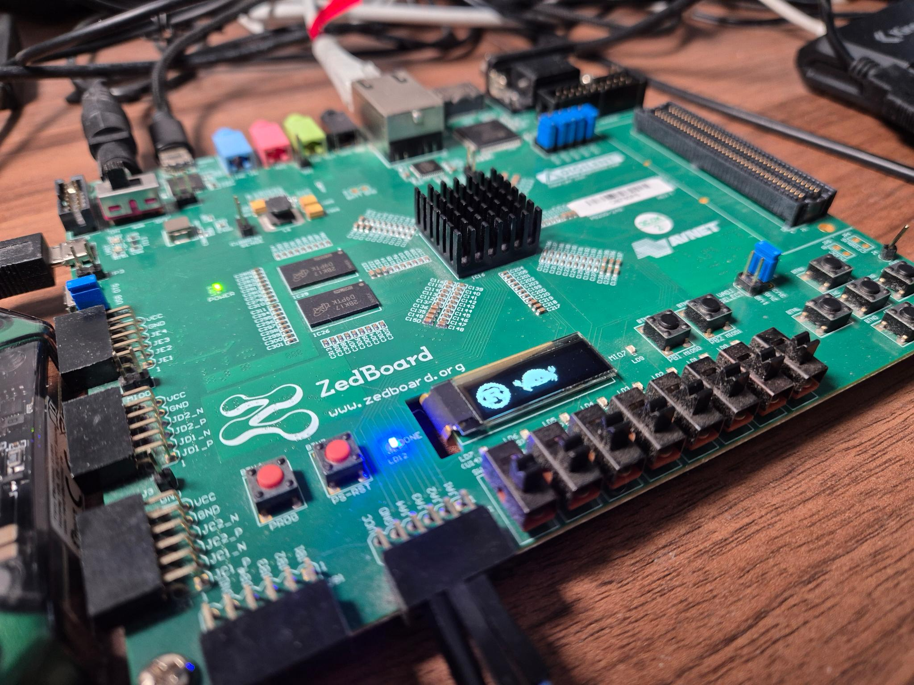

Zynq 7000 Bare-Metal Rust Support
=========

This crate collection provides support to write bare-metal Rust applications for the AMD Zynq 7000
family of SoCs.

<p align="center">
  
</p>

# List of crates

This project contains the following crates:

## [Firmware Workspace](./firmware)

This workspace contains libraries and application which can only be run on the target system.

- The [`zynq7000-rt`](./firmware/zynq7000-rt)
  run-time crate containing basic low-level startup code necessary to boot a Rust app on the
  Zynq7000.
- The [`zynq7000`](./firmware/zynq7000) PAC crate containing basic low-level register access API.
- The [`zynq7000-mmu`](./firmware/zynq7000-mmu)
  crate containing common MMU abstractions used by both the HAL and the run-time crate.
- The [`zynq7000-hal`](./firmware/zynq7000-hal) HAL crate containing higher-level abstractions on
  top of the PAC register crate and also contains embassy time drivers.

This project was developed using a Zedboard, so there are several crates available targeted towards
this board:

- The [`zedboard-bsp`](./firmware/zedboard-bsp)
  crate containing board specific components for the Zedboard.
- The [`zedboard-fsbl`](./firmware/zedboard-fsbl)
  contains a simple first-stage bootloader application for the Zedboard.
- The [`zedboard-qspi-flasher`](./firmware/zedboard-qspi-flasher)
  contains an application which is able to flash a boot binary from DDR to the QSPI.

It also contains the following helper crates:

- The [`examples`](./firmware/examples)
  folder contains various example applications crates using the HAL and the PAC.
  This folder also contains dedicated example applications using the
  [`embassy`](https://github.com/embassy-rs/embassy) native Rust RTOS.

## Other libraries and tools

- The [`zedboard-gateware`](./zedboard-gateware)
  folder contains a sample FPGA design and block design which was used in some of the provided
  software examples. The project was created with Vivado version 2024.1.
  The folder contains a README with all the steps required to load this project from a TCL script.
  If you just want a pre-built bitstream without installing Vivado, run `just download-zed-gateware`
  to download one directly into `zedboard-gateware/zedboard-rust.bit`.
- The [`z7-boot-image`](./host/z7-boot-image)
  library contains generic helpers to interface with the AMD
  [boot binary](https://docs.amd.com/r/en-US/ug1283-bootgen-user-guide).
- The [`z7-ps7init-extract`](./host/z7-ps7init-extract)
  tool allows extracting configuration from the AMD generated `ps7init.tcl` file which contains
  static configuration parameters for DDR initialization.
- The [`z7-run`](./host/z7-run)
  tool is a native Rust flashing/debugging tool which uses `probe-rs` to talk to a JTAG debug
  probe directly, without needing `xsct` or `hw_server`. See the
  [dedicated section below](#flashing-running-and-debugging-the-software---z7-run-app) for details.

# Using the `.cargo/config.toml` file

This is mostly relevant for development directly inside this repository.
Use the following command to have a starting `config.toml` file

```sh
cp .cargo/config.toml.template .cargo/config.toml
```

You then can adapt the `config.toml` to your needs. For example, you can configure runners
to conveniently flash with `cargo run`.

# Building the blinky example

Assuming you have the following segments inside your `.cargo/config.toml`

```toml
[target.armv7a-none-eabihf]
rustflags = [
  "-Ctarget-cpu=cortex-a9",
  "-Ctarget-feature=+vfp3",
  "-Ctarget-feature=+neon",
  "-Clink-arg=-Tz7link.x",
  # If this is not enabled, debugging / stepping can become problematic.
  "-Cforce-frame-pointers=yes",
  # Can be useful for debugging.
  # "-Clink-args=-Map=app.map"
]

[build]
target = "armv7a-none-eabihf"
```

You can build the blinky example app using

```sh
cd firmware
cargo build --bin blinky
```

# Flashing, running and debugging the software - z7-run app

The [`z7-run`](./host/z7-run) tool is a native Rust alternative to the TCL/`hw_server`-based flow
described below. It uses the [`probe-rs`](https://probe.rs) library to talk to the debug probe
directly, so it does not need `xsct` or a running `hw_server` instance. In a single invocation it:

- Connects to a JTAG debug probe and resets/halts the core.
- Executes the PS7 (PLL/clock/DDR/post-config) init sequence, read from a RON file as generated by
  [`z7-ps7init-extract`](./host/z7-ps7init-extract) (the replacement for a raw `ps7_init.tcl`
  script in this flow). This includes the post-config step (level shifters + PL reset deassert)
  that brings the PL out of its power-on reset state.
- Optionally flashes a bitstream to the programmable logic by calling out to the external
  [`openFPGALoader`](https://github.com/trabucayre/openFPGALoader) tool.
- Flashes and runs the given ELF file.
- Optionally attaches to a serial console and prints anything the target sends.

Keep in mind that this flow only supports a debug probe connected directly (via USB) to the
machine running `z7-run`. If you need to debug a board that is not directly attached to your
workstation, use the TCL/`hw_server`-based flow below instead, since `hw_server` supports
attaching to a remote target over the network.

## Pre-Requisites

Run `just prepare-repo` to perform both one-time setup steps needed for the `z7-run`
flow described below in one go: it downloads the pre-built Zedboard bitstream compatible to
the example apps provided in this repo and also installs the [`z7-run`](./host/z7-run) tool.

- A JTAG debug probe supported by `probe-rs` (e.g. the Digilent JTAG-SMT2 built into the
  Zedboard).
- On Linux, the `libudev` development headers and `pkg-config` must be installed on the host
  machine building `z7-run` (e.g. `apt install pkg-config libudev-dev` on Debian/Ubuntu), since
  `z7-run` pulls in `probe-rs`, which links against `libudev` for USB device enumeration. This is
  only required for the `host` workspace; it is not needed to build the `firmware` workspace.
- [`openFPGALoader`](https://github.com/trabucayre/openFPGALoader) installed and on `PATH`, if you
  want the bitstream flashing step.
- A valid Z7 bitstream for you board if you include the bitstream flashing step.
- A RON file containing the Z7 register initialization, generated from a `ps7_init.tcl` script using
  the [`z7-ps7init-extract`](./host/z7-ps7init-extract) tool. We provide a Zedboard compatible
  file at `scripts/zedboard_init_regs.ron`.

## Usage

1. Ensure that the `z7-run` program works for you.
   (or run `just prepare-repo`, which does this and also downloads the pre-built Zedboard
   bitstream in one go).

2. Optionally adapt the sample [`scripts/z7_run.toml`](./scripts/z7_run.toml) config file, which
   configures the bitstream path/`openFPGALoader` board name and an optional serial console to
   attach to once the target is running.

3. Set the `runner` in your `firmware/.cargo/config.toml` to `just run` (see
   [`firmware/.cargo/config.toml`](./firmware/.cargo/config.toml)), then use `cargo run` as usual,
   for example to flash the blinky example:

   ```sh
   cd firmware
   cargo run --bin blinky
   ```

   This calls the `run` recipe in the [`justfile`](./justfile), which in turn invokes `z7-run`
   with the `scripts/z7_run.toml` config and `scripts/init_regs.ron` regs file. You can also call
   `z7-run` directly; run `z7-run --help` for all available options, including `--regs`,
   `--config`, `--probe` and `--check-ddr` (a DDR read/write sanity check performed right after PS7
   init).

# Flashing, running and debugging the software - TCL script and runner

This repository was only tested with the [Zedboard](https://digilent.com/reference/programmable-logic/zedboard/start)
but should be easily adaptable to other Zynq7000 based platforms and boards.

If you want to test and use this crate on a Zedboard, make sure that the board jumpers on the
Zedboard are configured for JTAG boot.

This flow is kept alongside the `z7-run` flow above because `hw_server` supports remote
debugging: `hw_server` can run on a different, network-reachable machine than the one running
`xsct`/GDB, so you can debug a board that isn't directly attached over USB to your workstation.
The `z7-run`/`probe-rs` flow above only supports a probe connected directly to the local machine.

## Pre-Requisites

- [`xsct`](https://docs.amd.com/r/en-US/ug1165-zynq-embedded-design-tutorial/XSCT-Xilinx-Software-Command-Tool)
  tool installation. You have to install the [Vitis tool](https://www.xilinx.com/support/download/index.html/content/xilinx/en/downloadNav/vitis.html)
  to get access to this tool. You can minimize the download size by de-selecting all SoC families
  that you do not require. Vitis also includes a Vivado installation which is required to do
  anything with the FPGA.
- [`hw_server`](https://docs.amd.com/r/en-US/ug908-vivado-programming-debugging/Connecting-to-a-Hardware-Target-Using-hw_server)
  installation which is generally included with Vitis/Vivado. This tool starts a GDB server
  which will be used to connect to and debug the target board. It also allows initializing the
  processing system and uploading the FPGA design via JTAG.
- A valid `ps7_init.tcl` script to configure the processing system. This is necessary to even
  be able flashing application into the DDR via JTAG. There are multiple ways to generate this
  startup script, but the recommended way here is to the the `sdtgen` tool included in `xsct` which
  also generates a bitstream for the FPGA configuration. You can find a sample `ps7_init.tcl`
  script inside the `scripts` folder. However, it is strongly recommended to get familiar with
  Vivado and generate the SDT folder yourself.
- `gdb-multiarch` installation to debug applications.
- `python3` installation to use the provided tooling.

## Programming and Debug Flow

1. Start the `hw_server` application first. This is required for other tooling provided by this
   repository as well.

2. The provided `scripts/zynq7000-init.py` script can be used to initialize the processing system
   with the `ps7_init.tcl` script, program the bitstream, and load an ELF file to the DDR.
   You can run `scripts/zynq7000-init.py` to get some help and additional information.
   Here is an example command to initialize the processing system without loading a bitstream
   using the provided initialization script (adapt `AMD_TOOLS` to your system):

   ```sh
   export AMD_TOOLS="/tools/2025.2/Vivado"
   ./scripts/zynq7000-init.py --itcl ./scripts/ps7_init.tcl
   ```

3.  Assuming you have managed to build the blinky example, you can flash the example now
    using GDB:

    ```sh
    gdb-multiarch -q -x gdb.gdb target/armv7a-none-eabihf/debug/blinky
    ```

    You can use the `-tui` argument to also have a terminal UI.
    This repository provides a `scripts/runner.sh` which performs all the steps specified above.
    The `.cargo/config.toml.template` script contains the runner and some template environmental
    variables that need to be set for this to work. The command above also loaded the app, but
    this task can be performed by the `zynq7000-init.py` wrapper as well.

# Using VS Code

## Using the sample VS Code files

Use the following command to have a starting configuration for VS Code:

```sh
cp -rT vscode .vscode
```

You can then adapt the files in `.vscode` to your needs.

The provided VS Code configuration files can be used to perform the CLI steps specified above
in a GUI completely and to also have a graphical debugging interface. You can use this
as a starting point for your own application. You need to adapt the `options.env` variables
in `.vscode/tasks.json` for this to work.
